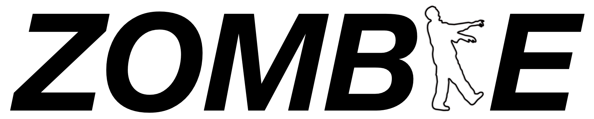
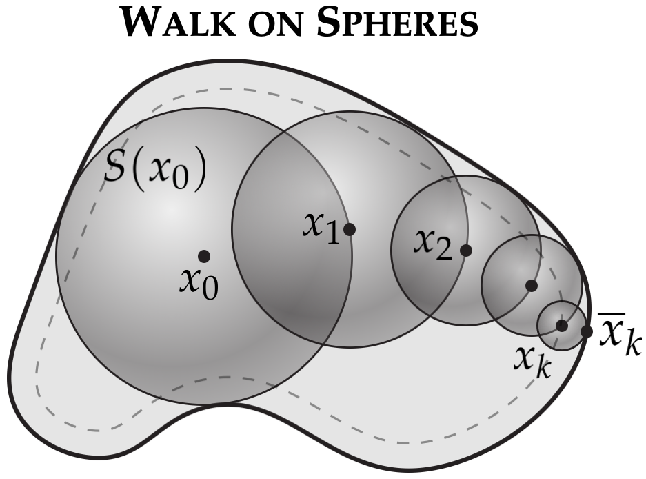
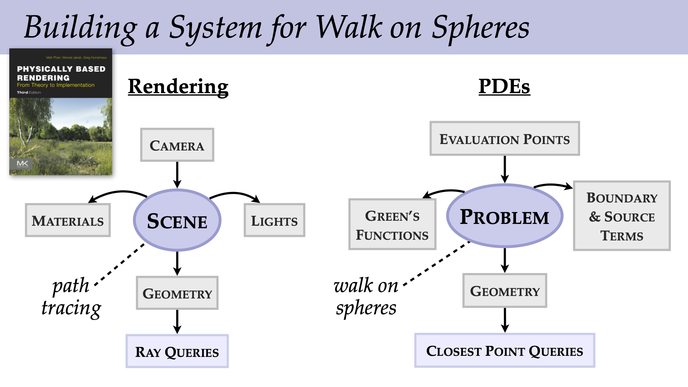

<p align="center">

</p>
<h1 align="center"><em></em></h1>


Zombie is a C++ header-only library for solving fundamental partial differential equations (PDEs) like the Poisson equation using the <a href="https://en.wikipedia.org/wiki/Walk-on-spheres_method"><em>walk on spheres (WoS)</em></a> method and its <a href="https://www.cs.cmu.edu/~kmcrane/Projects/WalkOnStars/index.html"><em>extensions</em></a>. Unlike finite element, boundary element, or finite difference methods, WoS does not require a volumetric grid or mesh, nor a high-quality boundary mesh. Instead, it uses random walks and the Monte Carlo method to solve the problem directly on the original boundary representation. It can also provide accurate solution values at a single query point, rather than needing to solve the problem over the entire domain. This <a href="https://www.youtube.com/watch?v=bZbuKOxH71o"><em>talk</em></a> provides an overview of WoS, while the following papers discuss its present capabilities in greater detail:<br><br/>

> Monte Carlo Geometry Processing [[_Project_](https://www.cs.cmu.edu/~kmcrane/Projects/MonteCarloGeometryProcessing/index.html), [_Talk_](https://www.youtube.com/watch?v=zl9GtPX0LjM&feature=youtu.be)]<br>
> Walk on Stars: A Grid-Free Monte Carlo Method for PDEs with Neumann Boundary Conditions [[_Project_](https://www.cs.cmu.edu/~kmcrane/Projects/WalkOnStars/index.html), [_Talk_](https://youtu.be/InWVU68KhMs)]<br>
> Grid-Free Monte Carlo for PDEs with Spatially Varying Coefficients [[_Project_](https://cs.dartmouth.edu/wjarosz/publications/sawhneyseyb22gridfree.html), [_Talk_](https://www.youtube.com/watch?v=dXROl0KGPXc)]<br>
> Boundary Value Caching for Walk on Spheres [[_Paper_](http://www.rohansawhney.io/BoundaryValueCaching.pdf), [_Talk_](https://www.youtube.com/watch?v=J9o7kgrpco0)]

WoS is a relatively new concept in graphics, rendering and simulation, and is an active area of research, e.g., [1](https://cseweb.ucsd.edu/~viscomp/projects/SIG21KelvinTransform/), [2](https://cs.dartmouth.edu/wjarosz/publications/qi22bidirectional.html), [3](https://diglib.eg.org/handle/10.2312/sr20231120), [4](https://riouxld21.github.io/research/publication/2022-mcfluid/), [5](https://arxiv.org/pdf/2208.02114.pdf), [6](https://rsugimoto.net/WoBforBVPsProject/), [7](https://www.irit.fr/STORM/site/coupling-conduction-convection-and-radiative-transfer-in-a-single-path-space/). Therefore, the algorithms provided in this library are by no means optimal: further work is needed not just to make the Monte Carlo estimators more sample efficient, but also to extend the class of PDEs they can handle. Zombie aims to serve as a reference implementation for the current state of the art. Visit this [repository](https://github.com/GeometryCollective/wost-simple) for a step-by-step [tutorial](https://github.com/GeometryCollective/wost-simple/blob/main/WoSt-tutorial.pdf) on the solver. A more optimized GPU implementation is currently in the works.

# Concepts

At its core, Zombie solves PDEs of the form:

$$
   \begin{array}{rcll}
      \Delta u &=& f & \text{on}\ \Omega, \\
             u &=& g & \text{on}\ \partial\Omega_D, \\
             \tfrac{\partial u}{\partial n} &=& h & \text{on}\ \partial\Omega_N, \\
   \end{array}
$$

where $\Omega$ is a domain in $\mathbb{R}^2$ or $\mathbb{R}^3$, and $f$, $g$ and $h$ are real-valued functions in $\Omega$, the Dirichlet part of the boundary $\partial\Omega_D$, and the complementary Neumann part of the boundary $\partial\Omega_N$ respectively. Zombie also supports [screened Poisson equations](https://en.wikipedia.org/wiki/Screened_Poisson_equation) with a constant absorption term ([variable coefficients](https://cs.dartmouth.edu/wjarosz/publications/sawhneyseyb22gridfree.html) are not currently supported). Boundary conditions and source terms are provided as user-defined [callback routines](https://github.com/rohan-sawhney/zombie/blob/main/include/zombie/core/pde.h) that return a value for any query point in the domain. Likewise, the domain boundary is queried using [callbacks](https://github.com/rohan-sawhney/zombie/blob/main/include/zombie/core/geometric_queries.h); Zombie currently supports boundaries represented as triangle meshes in 3D and line segments in 2D (see [here](https://github.com/rohan-sawhney/zombie/blob/main/include/zombie/utils/fcpw_scene_loader.h)), and uses the [*FCPW*](https://github.com/rohan-sawhney/fcpw) library to perform its geometric queries. The PDE solution (and optionally its spatial gradient) can then be evaluated at a set of user-specified evaluation points [indepedently](https://github.com/rohan-sawhney/zombie/blob/main/include/zombie/point_estimation/walk_on_stars.h) or through [sample caching](https://github.com/rohan-sawhney/zombie/tree/main/include/zombie/boundary_value_caching). The [demo](https://github.com/rohan-sawhney/zombie/tree/main/demo) application demonstrates how to use the concepts defined in the library.

<p align="center"></p>

# Compiling from source on Mac & Linux

```
git clone https://github.com/rohan-sawhney/zombie.git
cd zombie && git submodule update --init --recursive
mkdir build && cd build && cmake ..
make -j4
```

## Citation

```
@software{Zombie,
author = {Sawhney, Rohan and Miller, Bailey},
title = {{Zombie: A Grid-Free Monte Carlo Solver for PDEs}},
version = {1.0},
year = {2023}
}
```

# Authors

[Rohan Sawhney](http://www.rohansawhney.io), [Bailey Miller](https://www.bailey-miller.com)

# License

Code is released under an [MIT License](https://github.com/rohan-sawhney/zombie/blob/main/LICENSE).
