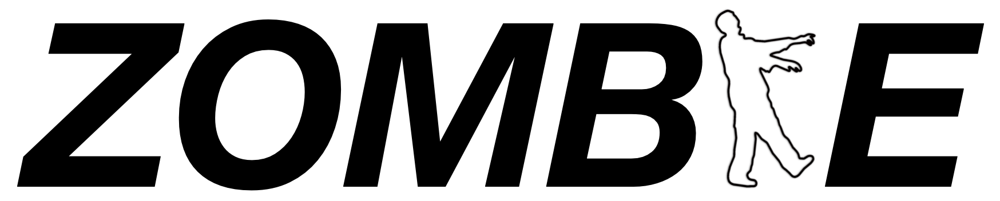
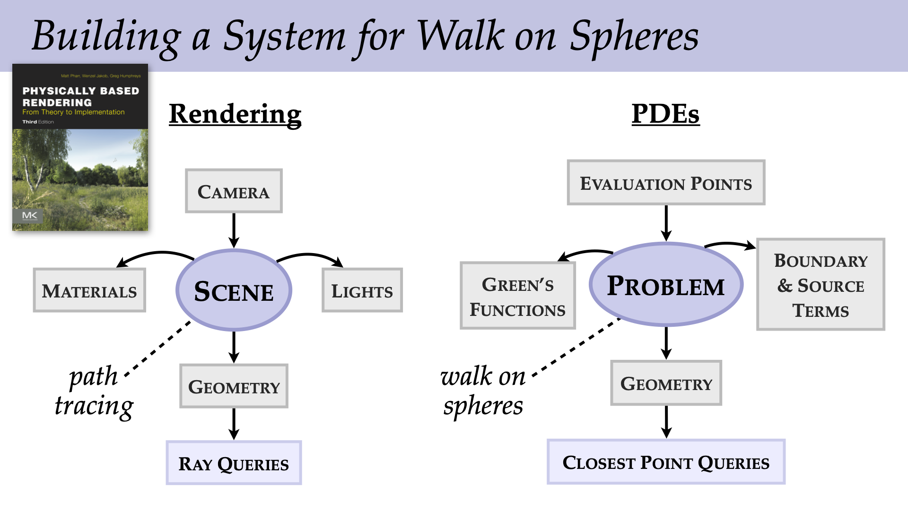

<p align="center">

</p>
<h1 align="center"><em></em></h1>

<p align="center">
<a href="https://github.com/rohan-sawhney/zombie/actions/workflows/ci.yaml"></a>


</p>


Zombie is a C++17 header-only library with Python bindings for solving partial
differential equations with [Walk on Spheres](https://en.wikipedia.org/wiki/Walk-on-spheres_method)-style
Monte Carlo methods. It is designed for problems where creating a volume mesh is
awkward, expensive, or unnecessary: the solver queries the original boundary
representation directly and estimates the solution only where values are needed.

***NEW!*** For GPU implementations of these algorithms, check out [WoSX](https://github.com/nv-tlabs/wosx),
which builds on Zombie with GPU support and additional 3D demo applications.

Zombie is research software. The algorithms are still an active area of research,
and the implementations are meant to be clear reference implementations rather
than final word on performance or variance reduction. For a broader introduction
to Walk on Spheres and its recent extensions, see this
[overview talk](https://www.youtube.com/watch?v=cmgNqCwaPYc) and this
[webpage](https://rohan-sawhney.github.io/mcgp-resources/) for in-depth resources
such as recent publications and tutorials.

## Getting Started

The best way to get started is through the demo application in [`demo/`](demo/).
It provides compact 2D reference problems for Laplace, Poisson, screened Poisson,
and multiple solvers. The folder has its own README with the problem setup,
expected outputs, and C++ and Python run commands.

## Core Workflow

Most Zombie applications follow the same high-level workflow:

1. Define geometric queries for the domain boundary, such as distance,
   intersection, and projection queries.
2. Define PDE data: source term, screening, and Dirichlet,
   Neumann, or Robin boundary conditions.
3. Choose sample/evaluation points where the solution and its
   spatial gradient should be estimated.
4. Choose a solver, run the random walks, and write or visualize the resulting values.

The same conceptual workflow applies in C++ and Python.

<p align="center"></p>

## Capabilities

Zombie targets scalar and vector-valued PDEs in 2D and 3D, including Laplace,
Poisson, and screened Poisson equations. Boundary conditions may be mixed
across the same boundary:

- Dirichlet: prescribed solution value.
- Neumann: prescribed normal derivative.
- Robin: linear combination of solution value and normal derivative.

Screened Poisson problems currently use a constant absorption coefficient.
Geometric queries are backed by [FCPW](https://github.com/rohan-sawhney/fcpw),
with line-segment boundaries in 2D and triangle-mesh boundaries in 3D. Exterior
problems can be handled through a [Kelvin transform](https://cseweb.ucsd.edu/~viscomp/projects/SIG21KelvinTransform/).

Available solver families include [Walk on Spheres](https://www.cs.cmu.edu/~kmcrane/Projects/MonteCarloGeometryProcessing/)
for Dirichlet conditions, [Walk on Stars for Neumann](https://www.cs.cmu.edu/~kmcrane/Projects/WalkOnStars/) and
[Robin](https://imaging.cs.cmu.edu/walk_on_stars_robin/) conditions, and
[Boundary Value Caching](http://www.rohansawhney.io/BoundaryValueCaching.pdf) and
[Reverse Walk on Stars](https://cs.dartmouth.edu/~wjarosz/publications/qi22bidirectional.html)
for noise reduction.

## Compiling from source on Mac & Linux

Requires CMake ≥ 3.21 and a C++17 compiler. Tested on Linux, macOS, and Windows.

```
git clone https://github.com/rohan-sawhney/zombie.git
cd zombie && git submodule update --init --recursive
mkdir build && cd build && cmake ..
make -j4
```

## Python Installation

After cloning Zombie and updating its submodules, build and install
the Python bindings from the project root using:

```
mkdir build
pip install . --force-reinstall
```

The Python API can be inspected from a Python console:

```
>>> import zombie
>>> help(zombie)
```

## Citation

```
@software{Zombie,
author = {Sawhney, Rohan and Miller, Bailey},
title = {Zombie: Grid-Free Monte Carlo Solvers for Partial Differential Equations},
version = {1.0},
year = {2023}
}
```

## Contributors

[Rohan Sawhney](http://www.rohansawhney.io)\
[Bailey Miller](https://www.bailey-miller.com)

## License

Code is released under an [MIT License](https://github.com/rohan-sawhney/zombie/blob/main/LICENSE).
