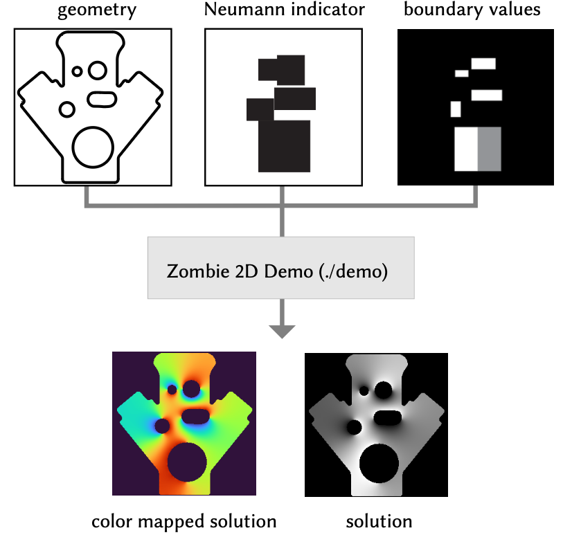
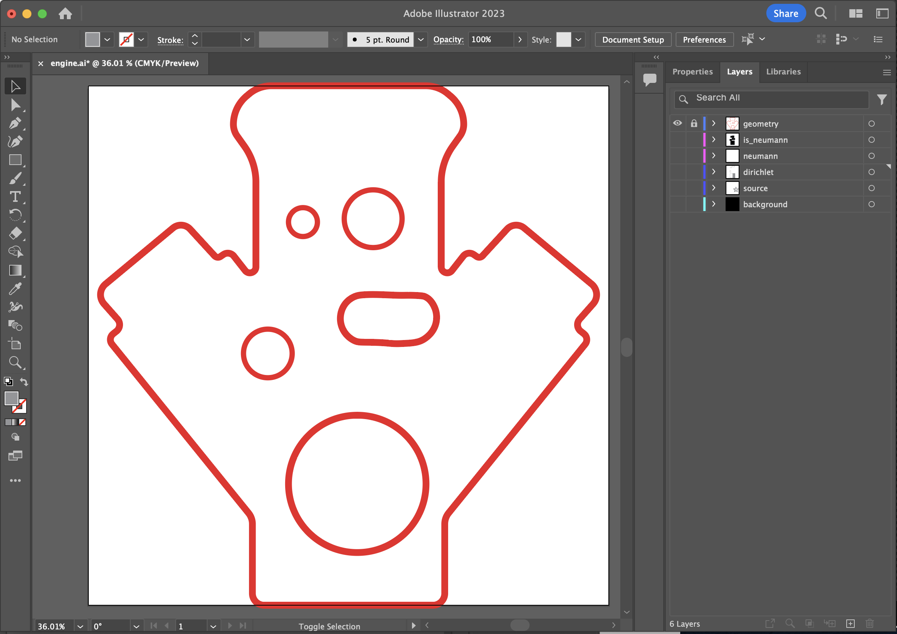

# Zombie 2D Demo

To run the demo scenes first build the Zombie library:

```bash
mkdir build
cd build && cmake ..
make -j4
```

Next you can run either [Walk on Stars](https://www.cs.cmu.edu/~kmcrane/Projects/WalkOnStars/index.html) or [Boundary Value Caching](http://www.rohansawhney.io/BoundaryValueCaching.pdf) from the build directory

```
./demo/demo ../demo/scenes/engine/wost.json
./demo/demo ../demo/scenes/engine/bvc.json
```

The results will be saved to `zombie/scenes/engine/solutions`.

## Custom Scene Creation

The Zombie 2D demo allows custom scenes to be created by specifying a boundary geometry, a Neumann boundary mask, and boundary and source textures. The Neumann indicator will determine whether a boundary is Dirichlet (black) or Neumann (white). The mapping from scene space to the mask is computed relative to the bounding box for the scene geometry.

<div align='center'>
  
</div>


These scene components are specified along with solver and output options in JSON scene files.

```
{
    "solverType": "wost",
    "solver": {
        "nWalks": 64,
        "maxWalkLength": 1024,
        "epsilonShellForDirichlet": 1e-3,
        "epsilonShellForNeumann": 1e-3,
        "ignoreDirichlet": false,
        "ignoreNeumann": true,
        "ignoreSource": true
    },
    "scene": {
        "boundary": "../demo/scenes/engine/geometry.obj",
        "isNeumann": "../demo/scenes/engine/is_neumann.pfm",
        "dirichletBoundaryValue": "../demo/scenes/engine/dirichlet_boundary_value.pfm",
        "neumannBoundaryValue": "../demo/scenes/engine/neumann_boundary_value.pfm",
        "sourceValue": "../demo/scenes/engine/source_value.pfm"
    },
    "output": {
        "solutionFile": "../demo/scenes/engine/wost.png",
        "gridRes": 256,
        "saveDebug": false,
        "boundaryDistanceMask": 1e-2,
        "saveColormapped": true,
        "colormap": "turbo",
        "colormapMinVal": 0.0,
        "colormapMaxVal": 1.1
    }
}
```

You can use a 2D illustration tool to create geometry, a Neumann indicator mask, and boundary and source textures. Assign each asset to a different layer and ensure that the size of the canvas matches the square bounding box for your boundary geometry as shown below

<div align='center'>
  
</div>


Next export the geometry as an SVG and the Neumann indicator and boundary and source textures as PNGs. You can then use the `svg2obj.py` script to convert the SVG to an OBJ.

```
./svg2obj.py engine/data/geometry.svg --normalize --auto_orient_curves
```

By changing the file extensions used in the config, you can use either PNGs or [PFMs](https://www.pauldebevec.com/Research/HDR/PFM/) for the texture data and solution outputs. Note that PNGs only support values between 0 and 255, which are clipped when writing out solutions whereas PFMs support arbitrary floating point values.
