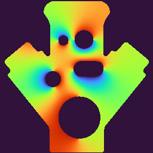
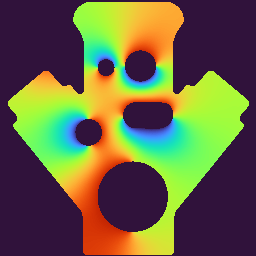
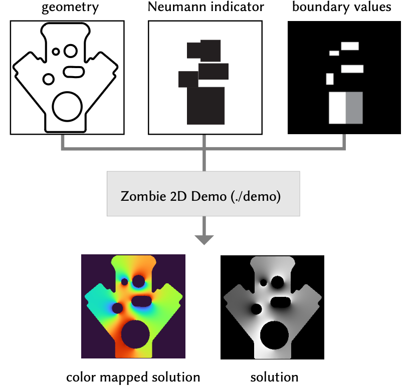
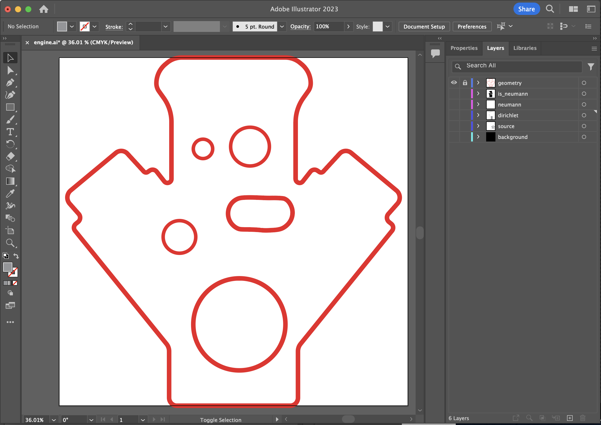

# Zombie 2D Demo

This demo is a compact 2D reference application. It reads a model problem from
JSON, builds the corresponding geometry and PDE data, and evaluates the solution
on a regular output grid. The demo supports Laplace, Poisson, and screened Poisson
equations with Dirichlet, Neumann, and Robin boundary conditions.

The engine model problem below compares Walk on Stars, Boundary Value Caching,
and Reverse Walk on Stars using the same boundary geometry and texture data.

<div align="center">

<table>
  <tr>
    <th>Walk on Stars</th>
    <th>Boundary Value Caching</th>
    <th>Reverse Walk on Stars</th>
  </tr>
  <tr>
    <td align="center"></td>
    <td align="center"></td>
    <td align="center"></td>
  </tr>
</table>

</div>

## Technical Details

Model problems combine boundary geometry, boundary masks, boundary/source
textures, and solver settings. The JSON field `solverType` selects the solver:
`wos`, `wost`, `bvc`, or `rws`. Walk on Stars, Boundary Value Caching and
Reverse Walk on Stars are available in both C++ and Python. The demo also
includes a Walk on Spheres path for simpler absorbing-boundary problems.

The PDE data can represent Dirichlet, Neumann, and Robin boundary conditions,
with optional source and absorption terms for Poisson and screened Poisson
variants. Outputs can be written as PNG or PFM files, with optional colormapped
PNGs for quick inspection.

## Running the C++ Demo

Run solver configurations from the build directory as follows:

```bash
cd build
./demo/demo ../demo/model_problems/engine/wost.json
./demo/demo ../demo/model_problems/engine/bvc.json
./demo/demo ../demo/model_problems/engine/rws.json
```

The engine results are written to `demo/model_problems/engine/solutions`.

## Running the Python Demo

Run the Python demo from the repository root:

```bash
python demo/demo.py --config=demo/model_problems/engine/wost.json
python demo/demo.py --config=demo/model_problems/engine/bvc.json
python demo/demo.py --config=demo/model_problems/engine/rws.json
```

## Custom Model Problem Creation

The Zombie 2D demo allows custom model problems to be created by specifying a boundary geometry, a reflecting (Neumann or Robin) boundary mask, and boundary and source textures. The reflecting boundary indicator will determine whether a boundary is Dirichlet (black) or Neumann/Robin (white). The mapping from scene space to the mask is computed relative to the bounding box for the boundary geometry.

<div align='center'>
  
</div>


These model problem components are specified along with solver and output options via JSON files.

```
{
    "solverType": "wost",
    "deviceBackend": "cuda",
    "solver": {
        "nWalks": 128,
        "maxWalkLength": 1024,
        "epsilonShellForAbsorbingBoundary": 1e-3,
        "epsilonShellForReflectingBoundary": 1e-3,
        "russianRouletteThreshold": 0.99,
        "splittingThreshold": 1.5,
        "ignoreAbsorbingBoundaryContribution": false,
        "ignoreReflectingBoundaryContribution": true,
        "ignoreSourceContribution": true,
        "disablePersistentThreads": false
    },
    "modelProblem": {
        "geometry": "demo/model_problems/engine/data/geometry.obj",
        "isReflectingBoundary": "demo/model_problems/engine/data/is_reflecting_boundary.pfm",
        "absorbingBoundaryValue": "demo/model_problems/engine/data/absorbing_boundary_value.pfm",
        "reflectingBoundaryValue": "demo/model_problems/engine/data/reflecting_boundary_value.pfm",
        "sourceValue": "demo/model_problems/engine/data/source_value.pfm",
        "robinCoeff": 0.0,
        "absorptionCoeff": 0.0,
        "solveDoubleSided": false,
        "solveExterior": false,
        "domainIsWatertight": true,
        "useSdfForAbsorbingBoundary": false
    },
    "output": {
        "solutionFile": "demo/model_problems/engine/solutions/wost.pfm",
        "gridRes": 256,
        "boundaryDistanceMask": 1e-2,
        "saveDebug": false,
        "saveColormapped": true,
        "colormap": "turbo",
        "colormapMinVal": 0.0,
        "colormapMaxVal": 1.1
    }
}
```

You can use a 2D illustration tool to create geometry, a reflecting boundary indicator mask, and boundary and source textures. Assign each asset to a different layer and ensure that the size of the canvas matches the square bounding box for your boundary geometry as shown below.

<div align='center'>
  
</div>


Next export the geometry as an SVG and the reflecting boundary indicator, boundary textures, and source textures as PNGs. You can then use the `svg2obj.py` script to convert the SVG to an OBJ.

```
./svg2obj.py engine/data/geometry.svg --normalize --auto_orient_curves
```

By changing the file extensions used in the config, you can use either PNGs or [PFM files](https://www.pauldebevec.com/Research/HDR/PFM/) for the texture data and solution outputs. Note that PNGs only support values between 0 and 255, which are clipped when writing out solutions whereas PFMs support arbitrary floating point values.
